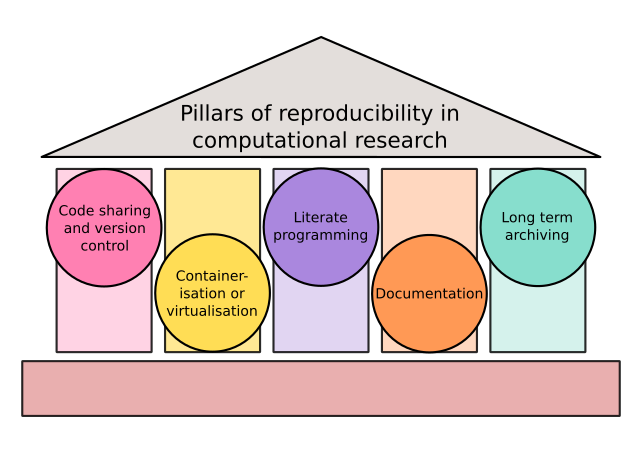

# A recipe for extremely reproducible enrichment analysis (Linux users)

Mark Ziemann and Anusuiya Bora

## Description

Enrichment analysis is a popular computational biology technique for interpreting omics data, but
typically these are conducted irreproducibly with web-based and graphical interface tools, which risks
omitting important methodological information.
To enable complete reproducibility, the analysis needs to be conducted non-interactively, recording the
versions of all dependancies.
This is achieved using an **R Markdown script** running inside a **docker container**.
This allows all instructions to complete the workflow in a sequence, including parameters which
sometimes are not described in methods sections.
R Markdown and other literate programming approaches are useful for such workflows because the end
result combines code, outputs (like charts and tables), together with free text, which can be used for
extended descriptions of experiment design, input data, interpretation of results, etc.
Using R allows to leverage the large ecosystem of bioinformatics software in CRAN and Bioconductor
repositories.
Containerisation with docker allows packaging of code, data and environment into a single reproducible
unit.
This means the workflow can be run on different types of computers (windows PC, Mac, server, cloud, etc)
and yield the same result.
This protocol also guides users through other best practices in computational research such as 
**code version control**, **documentation** and **data archiving**, which we consider the five pillars
of computational reproducibility (Figure 1).

This protocol is designed for Linux users who want to modify and remix the provided templates to
undertake their own enrichment analysis.
It requires a moderate level of shell scripting, some knowledge about docker containers, and moderate R
scripting.


<p align = "center">
Figure 1: The five pillars of computational reproducibility.
</p>

## Requirements

An internet-connected computer with Ubuntu 22.04 LTS installed.
This guide might also work for other Ubuntu versions or similar Linux distributions like Debian or
Mint (untested).
You will need "sudo" or administrator permission to install and run docker.
If you do not have a computer with linux installed, it may be possible to run it inside a virtual machine
using the VirtualBox software (not demonstrated in this protocol).

On the hardware side: 
CPU with 2 or more threads
8 GB of available system memory
20 GB of available system storage

You'll also need to create an account for the following services:
https://github.com/
https://hub.docker.com/

Also you will need some omics data to analyse. In this protocol we will begin with RNA-seq count data,
but it can be customised to work with a differential expression table or even a list of genes.

## Protocol steps

### Install Docker

**1. Open a terminal.**

Docker is a tool for working with containers, including building and running them.
It is essential for ensuring reprducibility.
We will install it using the command line interface, also known as the "terminal".
We're assuming this is the first time using Ubuntu, so you'll need know how to open a terminal.
This step only applies the the Ubuntu desktop, if you are using a server and only get a command line
interface you can skip to the next step. 

In the Ubuntu desktop, the terminal can be accessed from the applications menu, which can be accessed
by the "super" key, which is located between the ctrl and alt keys on the left side of a standard
English (US) keyboard. 

Now that you're in the activities overview, you can enter "terminal" in the search box, and the terminal
app should appear.

Click on the terminal app icon to get a terminal window.
You can also drag the terminal icon to the dock to keep it handy for later.

If you prefer keyboard shortcuts, Ctrl + Alt + T will also get you a terminal window.

**2. Update the system and install Docker.**

Once in the terminal, type the following to update the sources and update all currently installed
packages.
Note that you will need "sudo" permissions for this to work.

```bash

sudo apt update && sudo apt upgrade -y

```

When doing this, it is also good practice to remove unneeded packages with the following:

```bash

sudo apt autoremove -y && sudo apt autoclean -y

```

Now we can install the docker engine:

```bash

sudo apt install docker.io

```

This will install a stable version of docker that is packaged in the Ubuntu apt package manager.

**3. Add users to the docker group.**

In order to use docker without constantly needing to use "sudo", it is recommended to add yourself and
any other intended docker users to the docker group.

```bash

sudo usermod -aG docker ${USER}

```

But this will only take effect for new logins, so if you want to try docker immediately you should type
in the following which will log you in again.

```bash

su - ${USER}

```

Type the "groups" command in to check that you are member of the docker group.

```bash

groups

```

### Validate the example workflow

**4. Pull the image**

As docker is now installed, it is now possible to try to reproduce the example workflow described in
our article.
The first step is to fetch the workflow from dockerhub.

```bash

docker pull mziemann/enrichment_recipe

```

**5. Run a container**

Now run the docker container, getting a bash prompt.
This command also "binds" the present working directory to the working directory inside the container. 

```bash

docker run -it --entrypoint /bin/bash mziemann/enrichment_recipe

```
If you get a permission denied error at this stage, it could be that you don't have membership in the
docker group. Go back and complete the commands in step 3, then try again.

If it has started the container, run 'ls' here, you will see the project's Rmd scripts and the Reactome
gmt file.

**6. Run the R workflow**

Now open R.

```bash

R

```

Once inside R, run the example.Rmd script.

```R

rmarkdown::render("example.Rmd")

```

This will regenerate the analysis that was shown in the article.
The report is saved to "example.html"
If the workflow completed successfully, you can exit R with `q()` and the container with `exit`.

**7. Visually examine results**

Visually examine the html file.
It is easiest to do this outside of the container.
This command copies the newly created html from the last running container into the current directory.

```bash

docker cp $(docker ps -aql):/enrichment_recipe/example.html .

```

From there, you can use your favourite web browser to view the report.

```bash

firefox example.html

```

### Create a GitHub repository

**8. Install git**

`git` is a source control system that allows users to manage versions of software over time.
Use the following code to install git on your local machine:

```bash

sudo apt install git -y

```

**9. Create an account for GitHub**

GitHub.com is a website that hosts these software repositories, which has the benefit of making the
code widely available.
Visit the website and create an account.

**10. Set up SSH keys for GitHub**

GitHub requires authentication with SSH keys.
SSH (Secure Shell) keys are an access credential that is used in the SSH protocol.
Using SSH keys is much more secure than a password because the SSH key file is equivalent to a password
with >1000 characters.
We will use the SSH protocol to generate public and private keys. Keep the private keys secret, and
upload the public key to GitHub.
If you don't have any ssh keys in your ~/.ssh directory, type the following to generate them:

```bash

ssh-keygen

```

At the prompt it will ask about the location.
Continue with the default location.
It will ask about whether you want password to protect the keys.
It may increase security to add a password.
If you don't want a password, just leave it blank and hit enter.
It will then generate a randomart and a fingerprint.
You can safely ignore that.
Next, copy the public key text.
You can do this from the terminal with the following:

```bash

cat ~/.ssh/id_rsa.pub

```

It will show the contents of the public key.
Now return to GitHub.com, log in and in the top right of the window you will find the personal menu,
click on "Settings".
This will bring up a whole range of settings on the left side of the screen.
Under the "Access" heading you will see "SSH and GPG keys".
Click on that then you will see a green button labeled "New SSH key".
Hit it and paste the public key in the designated area and hit the green "Add SSH key" button.
Do not upload the private key.

**11. Create the repository**

A simple way to get git/GitHub working is to create a repo with Github and then clone it to the local
computer.
Return to your github personal profile page, eg: https://github.com/yourname and click on the tab
called "Repositories".
Click the green button labeled "New".
This will open up a new screen where you can set some options.

**a.** It is important to give your repository a good, descriptive, but short name. Avoid spaces.

**b.** Provide a one sentence description of your repository based on its purpose.

**c.** You can select to keep the repository private or to make it public.
Public is easier to work with if you don't mind that other people could be snooping at your work in
progress. 

**d.** It is recommended to add a README file to the new repo which can be worked on later.

**e.** Ignore the .gitignore for now (this is a list of file types that might be in the project working
directory but we don't want to have tracked by git).

**f.** Choose a license.
If you want your code to be made available to others without restrictive conditions you can pick a
license such as the MIT license.
If there is no licence in the repo, then it is assumed to be covered by copyright.

Once you are happy with your selections, hit the "Create repository" button

**12. Start working with the repo locally**

So far the repository exists on Github.com but not on the local machine.
Fix that by cloning the repo.
You probably don't want to do this in the home directory, rather in an area where you work.
My work folder is called "projects".
You can create a projects folder with the following command:

```bash

mkdir ~/projects

```

Then change to this directory:

```bash

cd ~/projects

```

Now clone the repository.
Click the green "<> Code" button and you will see that cloning can be done three different ways.
We will be using "SSH".
Copy the git URL provided in the SSH pane.

Go back to your terminal and type "git clone" and then paste your git URL so it looks like this:

```bash

git clone git@github.com:yourname/your-repo-name.git

```

And git should be able to complete the task for you.

**13. Try a commit/push**

If you are new to git, then it can be a bit confusing.
So it is best to try modifying the repo now, before working with code or data.
The first thing to do is to change directory (cd) into the project folder, then you can list the
contents (ls) and you will see the README and LICENSE if you selected one.

```bash

cd your-repo-name
ls

```

At this point I would recommend adding another few sentences to the README to explain more about the
project background.

To edit files in the terminal you can use a program called nano:

```bash

nano README.md

```

Use the arrow keys to navigate to the bottom of the file and use the enter key to add more lines if
necessary.
Enter the sentences about the project here.
If you want to add lots more information like subheadings, links, images, tables and other stuff, all
of that is possible with the Markdown syntax, and can be found on this ["cheatsheet"](https://github.com/adam-p/markdown-here/wiki/Markdown-Cheatsheet).
Once you're finished adding content to the README, exit nano using Ctrl + X.
It will prompt you to save, where you should select "y" and you will return to a normal command prompt.

Although the README file is updated, the changes haven't been recorded on the local repository nor on
Github.
In order to update the local git repository we use the following commands:

```bash

git add README.md
git commit -m "added some details to the README"

```

The git add command specifies to git that the file should be tracked for changes, and commit recognises
these changes and stores them in the repository.

If you get an error like "Please tell me who you are", follow the instructions in the error message to
specify to git your `user.email` and `user.name`.
I'd recommend providing the email address used to create the Github account and the Github username.

In order to make these changes effective on the "origin" repository on Github, we need to "push":

```bash

git push origin main

```

### Build a custom docker image for your project

**14. Understand the Dockerfile and modify it to your needs**

In this step you will build a docker image for your project.
This will contain the operating system, R/Rstudio and the packages you need for your analysis.
I have provided a [Dockerfile](https://raw.githubusercontent.com/markziemann/enrichment_recipe/main/Dockerfile)
you can use as a template, and remix as you need, for example by adding and removing R packages or
changing the Bioconductor version.
Copy the contents of the Dockerfile (text below), and then create a new file in your project directory
called "Dockerfile" using the command `nano Dockerfile`.
Paste the text using Ctrl + Shift + V.

Now I will walk you through the dockerfile which consists of just 6 commands.

```bash

# Docker inheritance 
# this is a ubuntu image with R, Rstudio and bioC
FROM bioconductor/bioconductor_docker:RELEASE_3_16

# Update apt-get
RUN apt-get update \
 	&& apt-get install -y nano git \
 	## Install the python package magic wormhole to send files
 	&& pip install magic-wormhole \
 	## Remove packages in '/var/cache/' and 'var/lib' 
        ## to remove side-effects of apt-get update
 	&& apt-get clean \
 	&& rm -rf /var/lib/apt/lists/*

# Install required CRAN packages
RUN R -e 'install.packages(c("kableExtra","vioplot","gplots","eulerr"))'

# Install required Bioconductor package
RUN R -e 'BiocManager::install(c("getDEE2","DESeq2","fgsea","clusterProfiler","mitch"))'

# Clone the repository that contains the research code and execute it
RUN git clone https://github.com/markziemann/enrichment_recipe.git

# Set the container working directory
ENV DIRPATH /enrichment_recipe
WORKDIR $DIRPATH

```

Note that each line starting with a hash (#) is a comment, so it is ignored by the program, but can
contain some useful information for the user.

The first command starting in "FROM" specifies the base image.
In this case it is the Bioconductor release version 3.16, which has R version 4.2.2.
These are maintained by the Bioconductor team and the Dockerfiles are kept [here](https://github.com/Bioconductor/bioconductor_docker).
When making your own docker image, you are suggested to use the most up-to-date release available.
That means taking a look at what Bioconductor images are available.
Do not use a `devel` branch.

On the [Bioconductor_docker page](https://github.com/bioconductor/bioconductor_docker), there are
several branches, each representing a different version.
There will be a "devel" image and several "release" versions.

The next command in the Dockerfile installs some system utilities that may be useful including `nano`,
`git` and magic-wormhole (`wormhole`).
`nano` is for text file editing, `git` is for source control, and `wormhole` is for transferring files
between computers.
This command also demonstrates how to install utilities with the apt and pip package managers, so you
can easily add your favourite utilities.
If you don't need any such utilities, the command can be safely deleted.

The next command installs some packages from CRAN that might be useful.
You can add your favourite CRAN packages to this.
The packages included in this Dockerfile are `kableExtra` for creating nice-looking tables, `vioplot`
for creating violin plots, `gplots` for simple heatmaps, and `eulerr` which makes nice Euler diagrams.

The next command uses `BiocManager::install()` to install Bioconductor packages.
The packages it installs are:

* [getDEE2](https://github.com/markziemann/getDEE2): which is a programmatic tool for fetching RNA-seq
data from the dee2.io resource.
It is used to fetch data in the example workflow, but you might not need it for your project if you have
your own data file.

* [DESeq2](https://bioconductor.org/packages/DESeq2/): a widely used differential expression tool.

* [fgsea](https://bioconductor.org/packages/fgsea/): a widely used tool for functional class sorting,
similar to GSEA.

* [clusterProfiler](https://bioconductor.org/packages/clusterProfiler/): a widely used tool for
over-representation analysis.

* [mitch](https://bioconductor.org/packages/mitch/): a tool for multi-contrast enichment analysis.

Again, you may need to add and remove packages here to your project's requirements.

The next step runs a command to clone your git repository.
This ensures that the docker image will already have a copy of your code when you launch a container.
You will need to change this line so it matches your Github alias and the name of your Github repo.
Note that this command will make a clone of the repo in the root directory, which will be used later as
the project working directory.

The last command in the Dockerfile sets the working directory, you should change this to the name of
your Github repo. 

**15. Think about how you will link your data and code**

Linking is ensuring that the code "knows" where to obtain the data from, so that users don't get
"file not found" errors.
The template workflow provided uses public data that is fetched from a website.
It is likely that you will need to change this so that you can analyse your own gene expression data.
There are a few options worth discussing:

**a. Include the data in the Github repo.**
If the data is very small, like a simple list of genes in a text file or an RNA-seq expression count
matrix, then it might be appropriate to commit and push these to the Github repo.
This only works well if the total data size is less than 100 MB, as large files can bloat the repo and
make it slow to work with.

**b. Copy the data into the Docker image during the build.**
If the data is a bit larger, it might be viable to copy it into the Docker image during the build
process with the following command:

```bash

COPY /source/file/path  /yourreponame

```

Where you will need to change /source/file/path to the actual path of the file.
For example if the current working directory is "/home/john/enrichment1", the data file is called
"genelist1.txt", and the repo/project name is "myenrichment", the command would look like this:

```bash

COPY /home/john/enrichment1/genelist1.txt  /myenrichment

```

**c. Deposit the data to an archive.**

While the above two options are the most convenient, this is the most robust option for long term
reproducibility.
Data archives like Zenodo and FigShare will accept large general data sets, and NCBI Sequence Read
Archive and Gene Expression Omnibus will accept high throughput sequence and microarray data.
This has the dual benefit of enhancing data reuse.

Of the above options, only option (b) will require you to make any changes to the Dockerfile.

**16. Build the new docker image**

Use the following command to build the new image.
Where it says "yourname", put your Dockerhub alias.
Where it says "yourprojectname", put the name of your project.
I'd suggest the same name as your Github repo.

For this step to work, it needs to be executed in a directory that has the
`Dockerfile` present.

```bash

docker build -t yourname/yourprojectname .

```

It may take up to 25 minutes to build it.

To confirm that the image has been built successfully, you can run the following command to
view the available images.

```bash

docker images

```

**17. Check that the docker image works**

The following command will run the image in a container and give you a bash shell prompt.

```bash

docker run -it --entrypoint /bin/bash yourname/yourprojectname

```

Here are the things you should check:

* The present working directory is indeed your cloned repo, and not the root directory

* That R can be opened, by typing `R` on the command line (record the version).

* That some of the CRAN and Bioconductor packages can be loaded using the `library()` command.

Once verified, quit R with the `q()` command and once back on the shell prompt type "exit" to leave the
docker container.

**18. Commit and push the Dockerfile to your repo**

Now that we know that the Dockerfile works, it is a good time to add it to your Github repo.
If you are still working in the project (git) directory, you can run the following to update the Github
repo.
Just to refresh your memory these commands do the following:

`pull`: sync your local machine with GitHub. This is especially important if you are working in a team, or you like to make changes to the GitHub repo using the browser.

`add`: This will activate track changes for the files selected.

`commit`: Will recognise and confirm the changes made locally.

`push`: Will propagate changes from local to Github repos, so they are in sync again.

```bash

git pull
git add Dockerfile
git commit -m "adding dockerfile"
git push origin main

```

### Customise the R Markdown workflow to your needs

**19. Launch an Docker based Rstudio server for development**

In this section, I will be walking you through the process of adapting the provided R Markdown
template workflow for your needs.
This will involve re-writing a lot of the code in the template R Markdown file, and so we need
to have a development environment.
We will do this inside the Docker container, using the Rstudio server.
To launch it, you will need to run the following command in a bash terminal on the host machine.

```
docker run -p 8787:8787 -e PASSWORD=bioc yourname/yourprojectname
```

Once launched, you can access the new Rstudio server using your internet browser by visiting
`http://localhost:8787/`.
Enter `rstudio` as the username and `bioc` as the password.
You will be greeted with the typical Rstudio development environment.
Important parts to locate are the "Console", "Terminal" and "Files" panes.
Notice that the working directory is user rstudio's home directory, and that it is empty.
In order for us to work with the files needed, firstly the project directory needs to be copied to
the user rstudio's home directory.

In a bash terminal, enter the commands:

```bash
cp -r /yourprojectname/ ~
cd yourprojectname
```

Then in an R console enter the following:

```R
setwd("yourprojectname")
```

Now the project directory will be visible in the files pane, click on it to see the contents.

Now fetch a copy of the template R Markdown script using the bash terminal.

```bash

wget https://raw.githubusercontent.com/markziemann/enrichment_recipe/main/example.Rmd

```

It should appear in the files pane and then you can click on it and a code editor will appear.
If at any time you want to change the file's name, close the editor window, select the checkbox next
to the filename in the files pane and hit "rename" and change it to something meaningful to you.
Just like other linux files, you should avoid spaces or special characters in the filename.

To reiterate, R Markdown is a literate programming script language that combines R together with
Markdown, a lightweight markup language.
It allows us to combine documentation together with R code and the results of the R analysis such as
charts and tables.
The ability to add documentation is really important as it allows us to write thorough descriptions of
the analysis such as background, methods, findings, conclusions and bibliography.
In fact it makes it possible to write a whole manuscript, just using R Markdown (and this is becoming
more popular). 

**20. Change the header to your needs**

Click on the Rmd file in the files pane to open the editor.
The header is a section the very top of the Rmd file delineated with three hyphens `---`

```bash

---
title: "An example of extremely reproducible enrichment analysis"
author: "Mark Ziemann & Anusuiya Bora"
date: "`r Sys.Date()`"
output:
  html_document:
    toc: true
    toc_float: true
    code_folding: hide
    fig_width: 5
    fig_height: 5
theme: cosmo
---

```

Naturally, you should change the title and author according to your project needs.
The `Sys.Date()` command ensures that the date of execution is recorded in the final report.
The other settings, like theme and figure size you should keep as-is for now until you have a working
workflow.

**21. Understand Markdown text**

Let's take a look at the next section in the Rmd file immediately below the header, which is Markdown.

```
Source: https://github.com/markziemann/enrichment_recipe

## Introduction

This guide is a R Markdown script that conducts differential expression and enrichment analysis, which
are very popular workflows for transcriptome data.
This is meant to be a boilerplate template, which you can remix and modify to suit your analytical needs.
In the code chunk below called `libs`, you can add and remove required R library dependancies.
Check that the libraries listed here match the Dockerfile, otherwise you might get errors.

```

There is a link to the source repository, which is good practice because it allows the reader to
inspect the raw code and its history.
Under that, we have a subheading called introduction, as denoted by hashes.
The more hashes, the smaller the subheading.
These are useful to structure your work, and the R Markdown engine recognises these to create a table of
contents.
Free text can be used to write descriptions of background information, methods and results, which
allows comprehensive documentation of workflows.
Your reports should have introduction, methods, results and conclusions sections.
A bibliography is recommended.
There are many formatting options provided by Markdown such as italics, bold, block quotes, numbered
and bullet points, tables, and it is possible to embed images and videos. 

To understand the capabilities of Markdown further, visit this [guide](https://github.com/adam-p/markdown-here/wiki/Markdown-Cheatsheet).

**22. Understand how code chunks are formatted**

R code is embedded in an R Markdown script inside "chunks".
There can be any number of chunks, and they can be any size, although we try to keep them to <50 lines.
They are delineated with triple backticks (`).
The chunk header comes after the triple backtics and it is bordered with curly braces ({}).
Inside the braces, you will find a lower case "r" which specifies to the render engine that this is R
code.
There is also an option to provide other information, such as a chunk name.
In the below example, the chunk name is "libs" because in that chunk, libraries (packages) are being
loaded.
Providing a unique name for each chunk is a good idea, and helps in troubleshooting errors if they occur.
(Ignore the single quotes in the chunk below).

There are many options that can be specified in the chunk header, from figure size, to captions, and
many other behaviours.
See this [guide](https://yihui.org/knitr/options/) for a deep dive into them.

```r

'```{r,libs}

suppressPackageStartupMessages({
  library("getDEE2")
  library("DESeq2")
  library("kableExtra")
  library("clusterProfiler")
  library("fgsea")
  library("eulerr")
  library("gplots")
})

```'

```

**23. Understand the workflow**

Before you start making changes to the workflow, it is a good idea to understand the overall process
first.
The example.Rmd script contains instruction for the five-step workflow.

**a.** It begins with fetching some RNA-seq data from a website called Digital Expression Explorer 2
(dee2.io), in the form of a count matrix.
The dataset is described at SRA under accession SRP038101, and was selected as it shows a robust effect
of treating AML3 acute myeloid leukemia cells with 5-azacytidine, an analog of cytidine which is thought
to inhibit DNA methyltransferases.

**b.** It performs some rudimentary quality control including tabulating read counts for each sample and
creating a multidimensional scaling plot (MDS).
MDS is similar to principal component analysis which is used to examine the variation between samples,
both inter-group and intra-group variation.

**c.** Then it conducts differential expression analysis with DESeq2.
Just before running DESeq2, genes with fewer than 10 reads per sample are discarded.
Setting a detection threshold like this is helpful for removing noise from lowly expressed genes.
Genes with false discovery rate adjusted p-values (FDR)<0.05 were considered significant.
The extent of differential expression was visualised with a smear plot.

**d.** Step 4 is parallel enrichment analysis with two different algorithms; over-representation analysis
with clusterProfiler, and functional class scoring with fgsea.
For clusterprofiler the significant up- and down-regulated genes were considered in separate tests using
the enricher() function.
The list of all detected genes was used as the "background".
The top clusterprofiler results are visualised as a barchart, but there are other visualisation options.
For fgsea, the Wald statistic was used as a ranking metric.
Top fgsea results are also depicted in a bar chart.
Reactome pathways were used for both ORA and FCS.
Gene sets with FDR<0.05 were considered as significant.

**e.** Then a comparison of the two enrichment approaches is conducted.
This includes an Euler diagram, which is a bit like a Venn diagram but the areas are proportional.
The jaccard index is calculated, which is a measure of similarity.
Finally, there are two additional visualisations, enrichment plots (from the fgsea analysis) for two
strongly enriched gene sets, and heatmaps to show the expression of member genes in each sample.

At the end of the Rmd script, there is a section called "Session Information" which describes the
environment including R version and version of other packages.

**24. Make targeted changes to your Rmd script**

It isn't within the scope of this protocol to delve deeply into the details of each chunk, rather
understand the modular nature of these chunks.
The types of modifications you might make are:

* Instead of fetching from DEE2, you analyse a count matrix that you have on disk or saved on a data
archive. 
Another example that I work with a lot is the [Set7KD dataset](https://www.ncbi.nlm.nih.gov/geo/query/acc.cgi?acc=GSE93236).

* Instead of RNA-seq, you have microarray data which would be better analysed with limma.

* Instead of performing differential analysis in R, you already have a list of genes in a text file which
you want to analyse.

* The format of the gene identifiers in the example.Rmd workflow is the ensembl identifier followed by
the gene symbol separated with a space (eg: "ENSG00000165949 IFI27").
This could be different in your data, and some work may be required to adapt the code for your gene
identifiers.

While working on the Rmd script, you will be prototyping code in the Rstudio window inside
the docker container.
The changes are not going to automatically appear in your main project directory, so you will need to
copy them over yourself.
While the code editor is open you can use the Ctrl+A and Ctrl+C shortcuts to copy the whole script
and then paste that into a text editor on the host machine, and save it to the main project directory
on the host machine.

If your Docker container is closed/shut down for any reason, you can restart the stopped container
and recover your work using the following command:

```
docker start  `docker ps -q -l`
```

The process of editing the template script is typically to begin at the top of the script and customise
all the sections to meet your needs, starting at the header.
To ensure that the code works, use Rstudio's "Run" button to run chunks in sequence.
There will be many modifications necessary to get your data workflow just right. 

The first type of challenge is to get the data you have loaded into R.
Use the suggestions in step 15.
If you have uploaded the data to a persistent archive, the script can fetch it from that location with
commands like `download.file()`.
If you have added the data file to the Github repo, it will be available to be read from the disk 
with functions like `read.table()`, `read.csv()`, `readLines()` or similar depending on the file format.

The next set of changes will be around differences in the format of the input datasets.
This includes the gene identifiers, but also ensuring that your data is in the correct structure.
For example DESeq2 requires the counts in a matrix, not a data frame.
Commands like `str()`, `class()` and `head()` can be used to diagnose the data structure.

If you're importing sets of gene identifiers for clusterProfiler, you can safely delete unnecessary
sections such as differential expression and fgsea.
Naturally, you can add additional analytics steps to the workflow.

Throughout this process, errors will arise.
Use google and other search engines to help you fix these problems.
AI chatbots might also be helpful.

Take another look at the libraries that are loaded near the top of the Rmd file, and remove the ones
that that are unnecessary. 

Once you are happy with the performance of each chunk, it is important to "knit" the entire Rmd script.
In Rstudio there is a "knit" button, but the `rmarkdown::render()` command also works.
This ensures the Rmd has no critical code errors (but doesn't guarantee the analytical validity).
Once knitted, you can also inspect the html report to ensure that all data visualistions, tables and
other elements are appearing as desired.

If you are happy with the appearance of the html report, we need to get the Rmd out of the container
and in the project folder so we can commit and push the changes.
Exit the container by hitting Ctrl+C in the window running the Docker container and use the
`docker cp` command.
Be sure to substitute you project/repo name and workflow Rmd name in the command below.

```bash

docker cp $(docker ps -aql):/home/rstudio/yourprojectname/yourworkflow.Rmd .

```

### Update the software repository

**25. Prepare changes**

Now that the Rmd script is working, it is time to push these changes to the GitHub repo.
Now is a good time to update the Dockerfile to remove unnecessary packages and add newly required ones.
Also take another look at the README and use nano to make any additional updates.

**26. Commit and push changes**

Use the `git add` command to track the changes of all files you intend to update on the github repo.
`git commit` to register the changes to the local repo and `git push` to propagate the changes to GitHub.

```bash

git add Dockerfile myworkflow.Rmd README.md
git commit -m "Rmd workflow working"
git push origin main

```

Then inspect the repo on github.com to ensure that all the neccessary files have been updated.

### Update the Docker image and push to Dockerhub

**27. Rebuild the Docker image**

It is necessary to rebuild the image so that the Rmd file is present.
The slow way is to rebuild using the exact same Dockerfile, but with caching switched off.

```
docker build --no-cache -t mziemann/set7kd .
```

A faster way (saving ~20 mins) would be to modify the Dockerfile slightly so that it uses the cached
build data as much as possible, by replacing this line:

```
RUN git clone https://github.com/markziemann/set7kd.git
```

With this:
```
RUN git clone https://github.com/markziemann/set7kd.git \
 && cd set7kd \
 && git pull \
 && cd -
```

It will ensure that the Docker image has the updated contents of the Gihub repo when you build:

```
docker build -t yourname/yourprojectname .
```

**28. Dockerhub push**

This is an optional step, which uploads your docker image to Dockerhub.
This is a good idea if you want to share it openly, however Dockerhub is not a guaranteed data archive
and might decide to remove your image in future.
If you don't want to push to dockerhub, skip to the next step.

You will need to visit dockerhub.com and make an account the "yourname" alias you used to build your
image previously.
You will also need to run a command to let the docker command line tool know who you are:

```bash

docker login -u yourname -p yourdockerhubpassword

```

Next, run "docker images" to bring up a list of images.
You should see the image that you built previously named "yourname/yourprojectname".
Type the following to push it:

```bash

docker push yourname/yourprojectname

```

Now your image is available on any other Linux computer with docker using the following command:

```bash

docker pull yourname/yourprojectname

```

The image will be publicly visible on Dockerhub (https://hub.docker.com/r/yourname/yourprojectname).
You should visit this page and add some details such as an extended description of the purpose of the
project, and a link to the GitHub repo.

See step 5 for a guide to reproducing the workflow on another system.
Just substitute the names for your docker image and your Rmd script.

### Long term archiving

**29. Save the image**

As Dockerhub is not a guaranteed data archive, there's a good chance that over time the company in
charge of Dockerhub removes images that are not monetised.
To protect against this and give your work a longer reproducibility horizon, you can store your Docker
image on a data archive like Zenodo.
Use the following command to save the docker image to a tar.gz file.

```bash

docker save yourname/yourprojectname | gzip > projectname.tar.gz

```

**30. Reproducibility check**

Before uploading to a data archive, it is a good idea to check that the tar.gz is also reproducible.
Try sending the tar.gz to another computer that has docker installed for reproduction.
Sending files can be done with rsync, ssh, wormhole or if you have physical access, a USB flash drive.
On the second computer, run the following:

```bash

gunzip projectname.tar.gz
docker import projectname.tar yourname/yourprojectname

```

Again, use step 5 as a guide for reproduction.

**31. Upload to Zenodo**

If you are new to Zenodo, you'll need to make a new user profile, then upload the image as a new
dataset.
Provide a thorough metadata about the image such as purpose, design, GitHub link and steps to reproduce
so that folks in the future can understand what it's about.
Include this link in you research article and it will be reproducible well into the future.

**32. Upload GitHub Repository to Zenodo**

From the repository homepage on GitHub.com you can download the full repo as a zip file.
This file can be uploaded to Zenodo for long term archiving.
Zenodo has an edit feature so you can update when future changes are made to the repo.
If the repository is expected to undergo frequent updates, consider depositing the repo at 
[Software Heritage](https://www.softwareheritage.org/).
