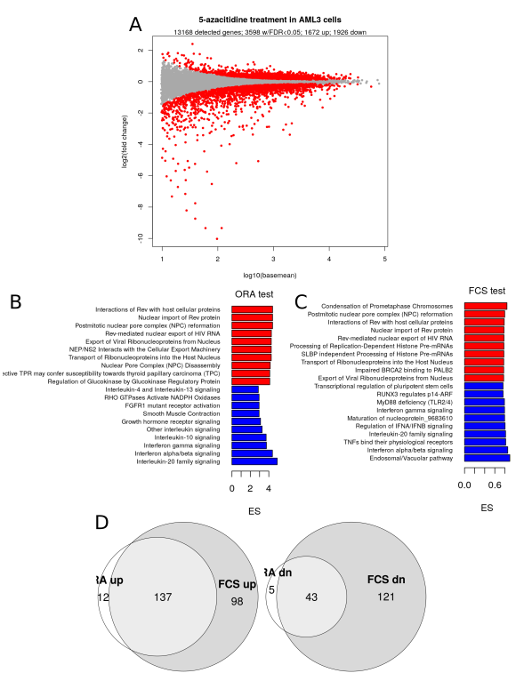

Mark Ziemann<sup>1</sup>*, Anusuiya Bora<sup>2</sup>

**Affiliations**

1. Deakin University, Geelong, Australia, School of Life and Environmental Sciences.

2. Vellore Institute of Technology, Vellore, India.

(*) Corresponding author: m.ziemann@deakin.edu.au

## Abstract

Unreliable and irreproducible research is a significant problem that wastes resources and risks
undermining the public perception of science.
Previous work has highlighted that published enrichment analyses frequently suffer from statistical
and reporting flaws.
We sought to determine whether this translates into irreproducibility by examining whether the
findings of 20 open-access articles describing enrichment analysis were reproducible.
We find that only three articles exhibited a high degree of concordance, while seven exhibited poor
reproducibility.
The findings indicate that current enrichment analysis practices are inadequate.
To address this, we provide a set of template scripts and a step-by-step protocol to adapt them to
a new project's enrichment analysis needs.
This recipe is built according to a framework we call "five pillars", which when implemented together
facilitates extreme reproducibility.

## Introduction

```{r,libs,echo=FALSE}

library("DiagrammeR")

```

Reproducibility is essential to the scientific enterprise by confirming the validity of new discoveries
[@Committee_on_Reproducibility_and_Replicability_in_Science2019-vb p1].
According to a 2016 survey of *Nature* readers, 52% of respondents agreed that there was a "significant
crisis" of reproducibility @Baker2016-hm.
While bioinformatics and other branches of computational research are theoretically amenable to
complete reproducibility, in reality this is rarely achieved due to lack of detail provided in methods
sections, lack of shared data and lack of code @Peng2011-ia.
Indeed, even if data and code are shared, reproducibility still cannot be guaranteed due to the
differences in computing environments over time, and the availability of dependencies @Perkel2020-io.

To address this, many articles have been written to endorse the use of "virtual machines" or
"containerisation" to control the computing environment including the operating system and dependencies
along with the research code to facilitate a high degree of reproducibility [@Perkel2020-io;
@Stein2010-of; @Dudley2010-ua; @Tan2010-is; @Sandve2013-lk; @Piccolo2016-ji; @Gruning2018-sg;
@Lewis2016-qh; @Da_Veiga_Leprevost2017-dw; @Pasquier2018-rt; @Kulkarni2018-km; @Hung2019-et;
@Brito2020-ld; @Piccolo2021-ud]
Containers also allow for an easy installation process, as all working dependencies are shipped together
and can be installed with a single command.

In addition to shared code, data and containerisation, there are a few ways researchers can make their
work more reproducible.
Firstly, thorough documentation makes the reproducibility process a great deal easier and more accessible
to novice bioinformaticians.
Version control keeps track of code and documentation changes over time and manages the edits made by
multiple contributors.
Literate programming using Rmarkdown or Jupyter notebooks provides optimal documentation by embedding
free text explanations together with the code and outputs such as charts and tables.
Secondly, code and data can be linked. This means that the code knows the location of the data,
avoiding any "file not found" errors @Peng2011-ia.
Lastly, reanalysis can be made as simple as possible by creating a master script that executes analysis
for each figure sequentially, making the entire manuscript reproducible by executing just one command
and without any manual steps @Lasser2020-mm.
Taken together, computational reproducibility is a spectrum (**Figure 1**) @Akalin2018-eg, and rests upon five key
pillars mentioned above (**Figure 2**).
Currently, bioinformatics work at the gold standard is rare, despite the availability of such tools for
over a decade.


```{r,5pillars,fig.cap="Figure 2. The five pillars of computational reproducibility.",echo=FALSE,fig.height=6}

library("RColorBrewer")
cols <- brewer.pal(5, "Set2")
cols2 <- adjustcolor( cols, alpha.f = 0.7)
plot(0,type='n',axes=FALSE,ann=FALSE, xlim=c(0, 10), ylim=c(0, 8.5))
polygon(c(0,1.8,1.8,0),c(1,1,6,6), col=cols2[1], border = NA)
polygon(c(2,3.8,3.8,2),c(1,1,6,6), col=cols2[2], border = NA)
polygon(c(4,5.8,5.8,4),c(1,1,6,6), col=cols2[3], border = NA)
polygon(c(6,7.8,7.8,6),c(1,1,6,6), col=cols2[4], border = NA)
polygon(c(8,9.8,9.8,8),c(1,1,6,6), col=cols2[5], border = NA)
polygon(c(-0.2,10,10,-0.2),c(-0.4,-0.4,0.8,0.8),col="lightgray", border = NA)
polygon(c(-0.2,5,10),c(6.5,8.5,6.5),col="lightgray", border = NA)
points( c(0.9,2.9,4.9,6.9,8.9) , c(4.5,2.5,4.5,2.5,4.5), pch=19,cex=18,col=cols )
text(5,7,lab="Five pillars of reproducible computational research", cex=1.5)

labs <- c("Version\ncontrol &\npersistent\ncode sharing",
  "Compute \nenvironment \ncontrol",
  "Literate\nprogramming",
  "Documentation",
  "FAIR &\npersistent\ndata sharing")

text( c(0.9,2.9,4.9,6.9,8.9) , c(4.5,2.5,4.5,2.5,4.5) , lab=labs)
text( 9, -0.2 , lab=expression(italic("created by Mark Ziemann")),cex=0.5)

```


In this article, we focus on enrichment analysis, which is one of the most used methods in
computational biology, and involves the summarisation of omics data to reflect biological changes,
such as the detection of pathway activation in development or disease
[@Slonim2002-sf; @Khatri2012-do].
While enrichment analysis is undoubtedly a key method for the interpretation of large
data sets, there are concerns that inadvertent misuse of these methods leads to
unreliable results.
These potential problems include (i) the lack of correct background for over-representation tests,
(ii) lack of p-value correction for multiple testing and (iii) lack of reporting detail
[@Timmons2015-ex; @Reimand2019-uw; @Wijesooriya2022-li; @Zhao2023-ok].
Without comprehensive methodological documentation and reproducibility, it isn't possible to verify
the validity of the methods and results.
We are concerned about the reliability of published enrichment analyses, as web-based and
point-and-click tools appear to be far more popular than computer script-based methods for this type
of work @Wijesooriya2022-li.
Although web-based tools are convenient, they are a potential reproducibility concern.
Firstly, incomplete reporting of methods, options and parameters is common.
Secondly, algorithms and functional annotation sets undergo regular updates, and previous versions are
typically not made available, hampering later reproducibility.
In some cases, the entire web resource can become unavailable, and hence irreproducible due to
a phenomenon known as link decay @Hennessey2013-tj.

A small number of enrichment analysis applications have been developed to have beneficial properties
of being "containerised" and with archived historical versions [@Ge2020-qe; @Perampalam2020-qm].
This helps reproducibility greatly but is not a complete solution as it lacks information about how
the input data was used and a record of any parameter selections.

A solution to this is to use containerisation to provide a scripted
workflow with prescribed links to research data, external databases and complete record of parameter
selection.
When designed correctly, these containers encapsulate bioinformatics workflows and could ensure their
computational reproducibility for decades to come with just one or a few simple commands.
There are multiple barriers to entry for such workflows including (i) the added difficulty compared to
existing point-and-click solutions; (ii) time poorness of researchers to learn new skills; and (iii)
a lack of step-by-step guides and templates aimed at beginner users.

We address this firstly by providing working templates for Docker image and Rmarkdown scripts for
common transcriptome and enrichment analysis routines.
Secondly, we provide step-by-step written and video guides to help users customise these templates for
their own work, deploy the analysis, verify the results, and share the Docker image.

However, before recommending or prescribing such workflows, it is necessary
to assess directly whether current practices are adequate, by trying to reproduce the enrichment
analyses of previously published studies, and examining whether the conclusions of those articles
are supported or not.
In the following section we investigate the computational reproducibility of enrichment analyses
shown in a sample of 20 open-access journal articles published in 2019.
This should provide a sound basis for recommendations.

## A systematic assessment of reproducibility in enrichment analysis

### Methods

From a list of 186 PubMed central articles using enrichment analysis that we examined previously
@Wijesooriya2022-li, we selected 20 articles that fulfilled the following criteria; (1) the
organism under study is human; (2) the tool used was DAVID Version 6.8 (Database for Annotation,
Visualization, and Integrated Discovery) @Huang2007-yw ; (3) the omics type was gene
expression (array or RNA-seq); and (4) that the gene list was provided in the supplementary data.
The basis for these selection criteria is that this combination represents the most common application
of enrichment analysis in our previous study, which could be reproduced without the need to
reanalyse the raw dataset from scratch. These articles are listed in the bibliography
[@Liu2019-nm; @Zhang2019-bq; @Zhang2019-zs; @Wang2019-il; @Balusamy2019-ue; @Ahn2019-wl; @Chai2019-cn;
@Guo2019-fx; @Alebrahim2019-zc; @Hong2019-ym; @Han2019-ix; @McSweeney2019-ij; @Wang2019-yw; @Pan2019-iv;
@Wang2019-jy; @Weigt2019-mk; @Najafi2019-ce; @Feltrin2019-to; @Wang2019-xx; @Sun2019-xr].

The lists of genes were collected from the supplementary files and stored in a spreadsheet, paying
special attention to preventing gene name errors from occurring @Zeeberg2004-na.
The reproducibility analysis was performed using the respective methodologies stated in the methods
sections of the 20 articles using DAVID version 6.8 (March-May 2022).

Briefly, we used the DAVID "Analysis Wizard" and pasted in the provided gene list into the text box,
selecting this as "gene list", together with the appropriate gene identifier type.
Typically this was the official gene symbol.
The species was specified as *Homo sapiens*.
Next we clicked on the "Functional Annotation Tool" link, bringing up the "Annotation Summary Results”
page.
We followed the steps indicated in the respective papers to select appropriate gene sets investigated
in the articles such as gene ontology (biological process, molecular function), KEGG pathways, etc.
Next, the "Functional Annotation Chart" was clicked on, opening a new window with a table of
enrichment results, which were saved for future reference.

The data presented in the paper was compared with the results we obtained, recording any
discrepancies.
Additionally, the statements made in the abstract, results, and discussion sections were carefully
examined and cross-checked with our results to understand whether those assertions survive reproduction
or not.

Each article was critically evaluated and given a score of one (1) to three (3).
Articles rated 1 showed overall poor reproducibility.
For example most GO and/or KEGG terms mentioned in the results and discussion were not confirmed
upon reproduction, and the conclusions of the study were overall not supported.
Articles were rated 2 when at least 50% of the terms are observed as significant after replication,
according to the original study's significance threshold, and most conclusions were supported.
Articles were rated 3 when they showed a high level of reproducibility, with 80% or more of the terms
shown in the article observed again in reproduction, and all conclusions were supported in reproduction.

### Results

After conducting this reproduction study according to the methods described in the respective articles,
the 20 articles were classified based on the degree of reproducibility (Figure 3).
Six studies were classified as low reproducibility, while 10 were classified as medium and just three
were classified as high.
Justifications for these classifications are provided in Table 1.

```{r,barchart,fig.width=6,fig.height=5,echo=FALSE,fig.cap = "Figure 3. Examining reproducibility in a sample of 20 journal articles."}

score1 <- c("PMC6405693","PMC6425008","PMC6535219","PMC6539328","PMC6542760","PMC6561911","PMC6663624")
score2 <- c("PMC6368841","PMC6381667","PMC6463127","PMC6557785","PMC6580941","PMC6591946",
  "PMC6582306","PMC6333352","PMC6526186","PMC6607402")
score3 <- c("PMC6349697","PMC6444048","PMC6587650")
l <- list("1-low"=score1,"2-medium"=score2,"3-high"=score3)

barplot(unlist(lapply(l,length)),col="lightgray",
  xlab="reproducibility score",ylab="no. articles",
  ylim=c(0,11))

grid()
text(0.7,1:7-0.5,labels=score1)
text(1.9,1:10-0.5,labels=score2)
text(3.1,1:3-0.5,labels=score3)

pc <- unlist(lapply(l,length)) / sum(unlist(lapply(l,length))) * 100
pc2 <- paste(pc,"%",sep="")
text(c(0.7,1.9,3.1),unlist(lapply(l,length))+0.4,labels=pc2)

```

| S.No. Pubmed ID: Replication of (Table/Figure) | A. Was Replication possible? B. Were there other significant terms found which were not mentioned in the article? | Replication score and justification |
| --- | --- | --- |
| 1.PMC6349697: Figure 2C and 2D | A. Yes, however, corrected p values are different after replication. B. Yes, only BP terms were taken into account so several CC and MF significant terms were not mentioned in the paper. |  **3.** Considering top 6 BP Terms and KEGG pathways. The basis of the selection of just 6 gene ontologies and 4 KEGG pathways shown in the paper needs to be addressed, when there is a higher amount of significant GOs and pathways that are observed after replication. It was impossible to determine if the article utilised a background gene list or not. The steps to perform DAVID analysis could have been elaborated in the paper. The results shown in the paper are observed after replication but only 6 BP GO significant terms are shown in the paper. |
| 2.PMC6368841: Figure 3 A - D | A. Only GO Terms were the same as the paper. KEGG terms were highly inconsistent. B. When replicated, KEGG Terms (using DAVID) were not mentioned in the results of the paper. Shows inconsistency due to the usage of the server. Some terms using clusterprofiler in R were mentioned. | **2.** GO results from the original manuscript are somewhat similar to reproduced analysis. The FDR values however are inconsistent. KEGG results were highly different. The list of genes as input into DAVID analysis is unclear. They should have mentioned that both up and down-regulated proteins were considered. |
| 3.PMC6381667: Figure 1 and Figure 2 | A. Results are not reproducible and are highly inconsistent B. N.A. | **2.** GO terms obtained after replication showed inconsistent results compared to the results in the original article. KEGG results were similar. Better naming convention for supplementary file for 117 genes for DAVID input is necessary. GO Results are not reproducible and are highly inconsistent. |
| 4.PMC6405693: Table 1 and Table 2; Texts under “Protein-Protein Interaction Network Building and Interrelation Analysis Between Pathways” | A. Results do not match. B. N.A. | **1.** GO analysis from up-regulated and down-regulated proteins are less similar to the results given in the paper. The FDR values for some pathways are highly inconsistent. KEGG Analysis of all DEGs do not match at all. |
| 5.PMC6425008: Most of the tables and figures of the paper (Figure 5, 6, 7), Table 2 | A. No. B. N.A. | **1.** This paper could have done proper labelling of supplementary files as it was difficult to find the gene list for DAVID analysis. Lacks information on when control genes are used and when citral-affected gene lists are used. Replication of GO and KEGG analysis is not consistent with results from the paper. How were Figures 5-7 derived? The overall protocol is not so coherent. |
| 6.PMC6444048: The text under “Pathway analysis of SUVmax related genes” And Table 2 | A. Terms are the same but gene counts have been different. The DAVID results are somewhat reproducible. B. No | **3.** Gene counts in the terms significantly enriched in the “process of cell division” and “nucleoplasm” have changed. Only cell cycle is highly enriched in the replicated results, the claims of metabolic pathways and hypoxia signalling (through GSEA analysis) to be enriched are not accurate. The results claimed are somewhat similar. All the processes have different FDR values. |
| 7.PMC6463127: Table 4, Table 5, Table 6 | A. Yes but the significance differed. B. Yes, several terms from replication were not mentioned in the paper for GO Analysis. | **2.** Does not consider corrected p values. Overall, significant terms from GO analysis of up and down-regulated DEGs are missing upon replication. |
| 8.PMC6535219: Figure 2 | A. Somewhat similar. B. There were many top significant terms that were not mentioned. | **1.** Narrowing/Filtering the given gene list is a required step that could have been mentioned. Many terms were not so significant anymore. There were new terms that are of top positions after replication. |
| 9.PMC6539328: Figure 1A | A. Mostly not. B. Yes, many | **1.** The significant pathways stated in the paper are not showing up once replicated. There is no clarity of the up-regulated genes used for GO and KEGG analysis. Only 21 up-regulated genes are listed whereas the paper states 4831. Also, why are only up-regulated genes used? |
| 10.PMC6542760: Figure 4 | A. No. B. Yes, many significant terms were observed. | **1.** Replication results of GO terms are not at all compliant with the results shown in the paper. |
| 11.PMC6557785: Figure 5 A-B | A. Yes, but results in paper are not significant upon replication. B. Yes | **2.** For GO terms, there are other terms that have higher numbers of genes, making them more enriched than immune-related pathways as mentioned in the paper. For KEGG Pathways, there are other pathways that are more significant and contain a higher number of genes enriched for example “Salmonella infection” that has a higher count of genes but is not mentioned in the paper. |
| 12.PMC6561911: Figure 5 a and b | A. No. B. N.A. | **1.** The enrichment analysis results are inconsistent with the results displayed in the paper. There was no KEGG analysis done |
| 13.PMC6580941: Table 1 and Table 2 | A. Yes. B. Yes! Significant terms like “nucleoplasm”, “RNA Binding”, “protein binding” are missing from the paper. | **2.** For GO analysis, the replicated results are not as significant as the GO terms shown in Tables 1 and 2 of the paper. The Gene list for input is not so clearly mentioned, it should have been labelled properly in the name of the supplemental file. P-values are completely different. |
| 14.PMC6587650: Figure 2 | A. Yes. B. Yes, some. | **3.** (Best) The GO terms results of BP, MF, CC and KEGG pathway results from the paper are compliant with replicated results. They could have mentioned why they chose the type of sorting shown in the paper to display their results. Overall, all results have been replicated. |
| 15.PMC6591946: Figure 5 c and Figure 6 a | A. Yes for GO analysis only. B. Yes for KEGG analysis | **2.** The GO term results of replication are compliant with Figure 5 c of the paper. KEGG pathway results are semi-consistent. |
| 16.PMC6663624: Table 3 and Table 4 | A. Yes. B. Yes | **1.** The top 2 significant GO terms in the paper are not significant after replication analysis is done. Other GO terms are the same as replicated results. For KEGG Analysis, some terms are more significant after replication. Eg: PD-L1 expression and PD-1 checkpoint pathway in cancer, Th1 and Th2 cell differentiation, Th17 cell differentiation were more significant after “natural killer (NK) cell-mediated cytotoxicity” KEGG Pathway. The paper is somewhat replicable. |
| 17.PMC6582306: Figure 5 | A. Partly. B. Yes, many. | **2.** The paper uses 44 sets of DEGs grouped in 4 major types. For replication, OFC Set 9 was used, DAVID GO analysis was done twice where a discrepancy of results was observed. Compared to the paper, the most significant term was missing after replication analysis was conducted. For OFC set 9, several pathways are seen after replication but only one pathway is shown in paper. This should be addressed. |
| 18.PMC6333352: Figure 7 | A. Yes. B. Yes. There was a difference in gene counts as well. | **2.** DAVID was used for KEGG Analysis: From WGCNA - Bahn - KEGG Analysis: Epstein-Barr virus infection, the pathway with the highest gene count is missing in the results shown in the paper. From NERI - BAHN - KEGG Analysis: “Pathways of neurodegeneration - multiple diseases”, “Pathways in cancer” - pathways with the highest gene count (30 and 28 respectively) are not mentioned in the paper. Other pathways are present and the paper is somewhat reproducible. |
| 19.PMC6526186: Table 1 | A. Yes. B. Yes. | **2.** The top BP GO terms from the paper are no longer significantly higher in the replicated GO results. The top 2 KEGG Pathways after replication are “Human cytomegalovirus infection” followed by “Pathways in cancer”. The p-values have changed after the results were replicated, compared to the values given in the paper. The rest of the pathways are similar to the results given in the paper. |
| 20.PMC6607402: Figure 1 A-D | A. Yes. B. Yes, many! | **2.** For GO analysis and their replication, top enriched BP, CC and MF GO terms are not mentioned. Most of the terms are mentioned in the replicated results, but different levels of enrichment. |

: Table 1. Classification and justification for each article.

Taken together, the ability to replicate DAVID enrichment analysis using the supplementary gene
lists was highly variable.

## A container-based approach to addressing reproducibility of enrichment analysis

### Implementation

We have developed a step-by-step protocol for how to conduct an extremely reproducible
enrichment analysis, which is attached as a supplementary file (Suppl Info 1) and published to
protocols.io with a permissive license.
This protocol has the features of reproducibility mentioned in **Figure 1** and **Figure 2** including
version control with git and GitHub, compute environment control using Docker, literate programming
with Rmarkdown, persistent code and data sharing with Zenodo and documentation of all of these to
empower others to reproduce the workflow.

Central to this protocol is the provision of template Dockerfile and an Rmarkdown script, which
are intended to be remixed and altered by the end user to suit the needs of their project.

The Dockerfile uses a base image from Bioconductor which should correspond to the latest available
stable release version (currently 3.16), running on R v4.2.2 and Ubuntu 22.04.
The image contains instructions for installing a few useful utilities including `nano` and `git` for
modifying scripts, and `magic-wormhole` for transferring data between computers.
It installs R packages from CRAN and Bioconductor repositories to fulfill common tasks in transcriptome
analysis such as fetching RNA-seq counts from DEE2 with `getDEE2` @Ziemann2019-zo,
differential expression with `DESeq2` @Love2014-hd,
enrichment analysis with `clusterprofiler`, `fgsea` and `mitch`
[@Yu2012-ts; @Korotkevich2016-ls; @Kaspi2020-dq].
It also contains instructions to clone a github repository, which contains the scripts that run the
analytical workflow.
Lastly, it copies a gene set library from Reactome @Gillespie2022-gz with a clear version
history to guarantee provenance of the annotation data.

The Rmarkdown script called `example.Rmd` undertakes the transcriptome and enrichment analyses.
Rmarkdown allows the unification of extended descriptions, code and results into a single document,
which is becoming ubiquitous in bioinformatics and data science more generally
@Grolemund2017-zl p423.
The ability to provide extended descriptions is helpful for providing contextualising information about
the purpose of the work, detailed methods and interpretations derived from the analysis.
The Rmarkdown script contains code chunks that perform specific tasks including fetching an example
data set from DEE2, inspecting data quality, differential expression and two types of enrichment
analysis: over-representation analysis (ORA) and functional class scoring (FCS) (**Figure 4**).
For each enrichment analysis conducted, a checklist is provided to comply with reporting guidelines
@Zhao2023-ok.

```{r,diagram,echo=FALSE,fig.cap = "Figure 4. Flow chart of example workflow."}

library("DiagrammeR")
grViz("digraph flowchart {
      node [fontname = Helvetica, shape = rectangle]
      tab1 [label = '@@1']
      tab2 [label = '@@2']
      tab3 [label = '@@3']
      tab4 [label = '@@4']
      tab5 [label = '@@5']
      tab6 [label = '@@6']
      tab1 -> tab2 -> tab3 -> tab4 -> tab6;
      tab3 -> tab5 -> tab6 }
      [1]: 'Fetch RNA-seq from DEE2'
      [2]: 'Quality control'
      [3]: 'Differential expression'
      [4]: 'Over-representation analysis'
      [5]: 'Functional class scoring'
      [6]: 'Euler diagram'
")

```

The software versions used in this example analysis are provided in Table 2.

| Software | Version | Purpose |
| --- | --- | --- |
| Ubuntu | 22.04 | Operating System |
| R | 4.2.2 | Statistical computing language |
| nano | 6.2 | text editing |
| git | 2.34.1 | source control |
| R/kableExtra | 1.3.4 | render formatted tables |
| R/vioplot | 0.4.0 | violin charts |
| R/gplots | 3.1.3 | heatmaps |
| R/eulerr | 7.0.0 | Venn diagrams |
| BioC/getDEE2 | 1.8.0 | fetch example RNA-seq data |
| BioC/DESeq2 | 1.38.3 | differential expression |
| BioC/fgsea | 1.24.0 | functional class scoring |
| BioC/clusterProfiler | 4.6.1 | over-representation analysis |
| Bioc/mitch | 1.10.0 | multi-contrast enrichment |

: Table 2. The software bundled in the example Docker image.

To reproduce this work is relatively quick and simple, requiring six commands and approximately four
minutes to install Docker, pull and run the container, run the Rmarkdown script, exit the container
and copy the newly created report from the container to the current working directory (Box 1).

```bash
sudo apt update && sudo apt install docker.io -y  # 30 sec
sudo docker run -it --entrypoint /bin/bash mziemann/enrichment_recipe #60 sec
Rscript -e 'rmarkdown::render("example.Rmd")' # 90 sec
exit
docker cp $(docker ps -aql):/enrichment_recipe/example.html . # instant
firefox example.html
```
<p style="text-align: center;">
*Box 1. Reproduce a transcriptome and enrichment analysis with Docker.*
</p>

### Demonstration

To demonstrate the utility of this workflow, we present the results of this example data analysis;
it is a comparison of control and 5-azacitidine-treated AML3 cell transcriptomes with RNA-seq
in triplicate @Lund2014-et.
We use this analysis to better understand the effect of DNA methyltransferase inhibitors on
genome regulation and elaborate upon previous findings by Lund et al (2014), which mainly focused on
the relationship between RNA expression and DNA methylation, but did not show results of a
transcriptome-only enrichment analysis.
Furthermore, we provide a comparison of the two most common approaches for enrichment analysis; ORA and
FCS, and give guidance for interpreting results of such tests.

For quality control the number of reads per sample was calculated, and found to be in the range of
11-16M.
Genes with fewer than 10 reads per sample on average were removed from the analysis, leaving 13,168
genes.
Differential expression analysis revealed 3,598 differentially expressed genes with FDR<0.05, with
1,672 exhibiting higher expression and 1,926 exhibiting lower expression in 5-azacytidine treated cells
(Figure 5A).
Up and down-regulated gene sets were subjected to ORA separately, using the list of
13,168 genes as the background, and gene sets from REACTOME.

With ORA, we observed 149 up-regulated and 48 down-regulated gene sets.
We prioritised the enrichment analysis by enrichment score, a pseudo measure for effect size,
which tends to highlight smaller and more specific gene sets undergoing more drastic differential
expression, rather than large gene sets that undergo small expression changes.
This led to the identification of up-regulated pathways related to nuclear RNA export,
glucokinase regulation and G1/S DNA replication pathways; while down-regulated pathways
were associated with interferon signaling, interleukin signaling, granulopoiesis and NADPH oxidase
(host defence) (Figure 5B).

After FCS, we identified 241 up-regulated gene sets and 155 down-regulated gene sets.
FCS up-regulated pathways were associated with prometaphase chromosome condensation, nuclear RNA export
and defective homologous recombination repair (Figure 5C).
Down-regulated pathways related to endosomal/lysosome pathway, interferon signaling and TLR/TNF signaling.

Regarding up-regulated pathways, the similarity between ORA and FCS was relatively high, exhibiting a
Jaccard index of 0.54, however these methods disagreed in down-regulated pathways, with a Jaccard
index of only 0.27 (Figure 5D).



## Concluding remarks

Although our reproducibility study was relatively small, there are a few key observations.
We observe that only 3/20(15%) of studies achieved a high degree of reproducibility.
In a way, this is surprising, given the simplicity of using DAVID, only
requiring the user to provide a list of genes in a text box and select some options.
These irregularities may have arisen inadvertently from several sources:

* The methods stated in the respective articles are inconsistent with what was actually done.

* The list of genes in the supplement is not the same as what was used for enrichment analysis.

* Ambiguity around whether up- and down-regulated genes were considered
separately or together.

* Ambiguity around whether all GO classes were considered or just one, such as "biological process".

* Ambiguity around whether a custom background gene set was used.

The observed lack of reproducibility might be expected given that substantial methodological flaws
were present in 85% of enrichment analyses as part of a wider survey of articles of a similar age
@Wijesooriya2022-li.

While researching the literature on computational reproducibility in bioinformatics, we identified
some case studies but only one other systematic examination of multiple journal articles.
Ionnidis et al @Ioannidis2009-hv examined a set of 10 gene expression studies with available data
published in 2005-2006, and found only two could be reproduced to a satisfactory level.
More work in this direction is urgently needed to understand the causes of irreproducible bioinformatics
research so it can be remedied, as reproducibility is considered only the first step towards
reliability.

This problem is not limited to bioinformatics.
In the field of drug development, according to a 2011 study by Bayer, only 25% of projects could be
replicated to a high degree @Prinz2011-ht.
When the US Biotech firm Amgen set out to reproduce 53 landmark cancer studies, they were able to
reproduce only 6 (11%) @Begley2012-di.
It is clear that as a field, the life sciences need to raise the rate of reproducibility or risk the
public perceiving it as unreliable and wasteful.

We propose the five pillars (**Figure 2**), as a framework to guarantee computational reproducibility.
However, these concepts may be difficult for novice analysts, and so we provide a step-by-step
protocol to guide them on how to customise template Dockerfile and Rmarkdown scripts to suit their
project's needs.
Although we aimed to make this process as easy as possible, it requires a substantial time outlay, which
we estimate at 15-20 hours.
This is significantly longer than using a web-based tool that provides results in just a few
minutes, but we argue the time investment is well spent.
It ensures analytical reproducibility, assists with auditing and makes the process of reproduction
simple and fast (Box 1), which should aid the early identification of errors.

We also want to emphasise that there is still a definite need for graphical and web-based tools.
These are good for data exploration, to quickly identify trends that can be followed up with more
rigorous methods.
Moreover, a lot of work is being done to make such point-and-click tools more reproducible.
The Galaxy, GenePattern and RNAlysis projects offer graphical tools to create, edit and import
workflows that enable reproducibility [@Kuehn2008-su; @Goecks2010-lq; @Teichman2023-fx].
The Degust differential expression suite is a graphical interface to popular
expression tools like edgeR and limma, and allows users to download the script to facilitate future
non-interactive reproducibility @Powell2019-lv.
Such functionality could be written into existing enrichment analysis tools like DAVID, and together with
retention of historical gene annotation sets could provide a "good enough" solution to reproducibility.

Although we hope that extremely reproducible enrichment analysis will become more widespread, we do not
anticipate any dramatic changes in researcher behaviour unless the motivating factors are addressed.
Currently, reward structures in academia favour career progression for individuals who publish many
articles as opposed to individuals who publish fewer but more rigorously conducted works.
Solutions to this could include mandates by funding agencies or institutions @Garijo2013-zb,
badging of articles that comply with best practices @Kidwell2016-pm, and recognition of research rigour
in track record evaluations.

## Acknowledgements

This research was supported by use of the Nectar Research Cloud, a collaborative Australian research
platform supported by the NCRIS-funded Australian Research Data Commons (ARDC).

## Availability of materials

* Protocol: https://github.com/markziemann/enrichment_recipe/blob/main/docs/guide_for_linux_users_with_docker.md
A final version will be deposited to protocols.io.

* Code repository including template Dockerfile and Rmarkdown script: https://github.com/markziemann/enrichment_recipe

* Example Docker image: https://hub.docker.com/r/mziemann/enrichment_recipe

## Bibliography
